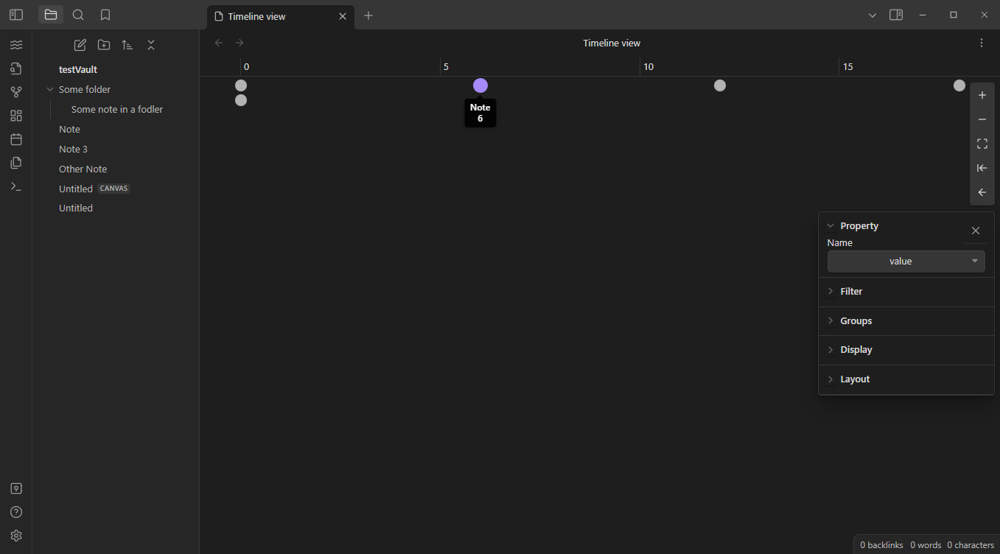
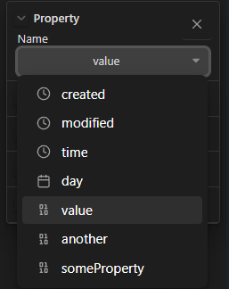
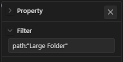
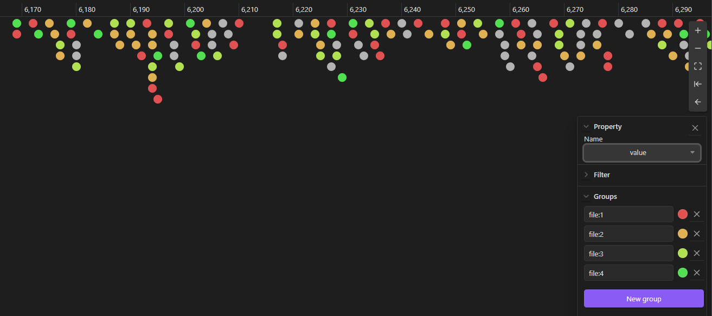
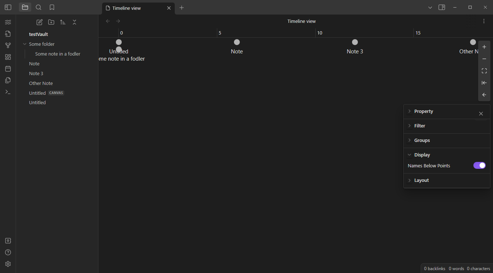

# Timeline View

Display your obsidian notes in a timeline, based on a given property.

## Features

### Property
Select whichever property you'd like to use to order the notes.  "created" will order the notes based on the time they were created, "modified" will order them based on the time they were modified.

Any other property name can be used.  If a given note does not have the property, it will default to `0`.

Timeline view will automatically detect all the properties you have defined in your vault, and their types.

When a property is selected, the notes will automatically be re-arranged, and the appropriate type of measurement will appear at the top of the timeline.

### Filter
Don't want to see *every* note in your vault?  Use a filter!  This allows you to only focus on the notes you currently care about (maybe for a subproject?).

The filter (mostly) follows the same query syntax as the built-in obsidian search feature, but has some limitations (see [obsidian search](https://github.com/b-camphart/obsidian-search) for the latest query syntax supported).

This will also change the name of the tab to match the provided filter, allowing you to differentiate two or more timeline tabs you may have open.

### Groups
In conjunction with the filtering feature above, you can use the same query syntax to apply colors to the notes in the timeline - just like the built-in graph view.

### Names below points
Toggle if you'd like to see the names of notes below their point on the timeline.  

This is off by default, as any notes that are close together may overlap.  However, you can place your mouse over a note to display both its name, and the value it has for the selected property.

# Roadmap

- [x] Filter based on obsidian query
- [x] Color groups based on obsidian query
- [ ] [Manual Vertical Positioning of Notes](https://github.com/b-camphart/plot-point-timeline/issues/1)
- [ ] [Vertical Layout](https://github.com/b-camphart/plot-point-timeline/issues/2)
- [ ] [Create new note with property based on filter and position in timeline](https://github.com/b-camphart/plot-point-timeline/issues/4)
- [ ] [Embeds?](https://github.com/b-camphart/plot-point-timeline/issues/6)
- [ ] [Mobile support](https://github.com/b-camphart/plot-point-timeline/issues/7)
- [ ] Duration/length and/or end property