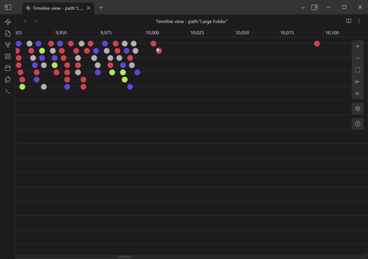
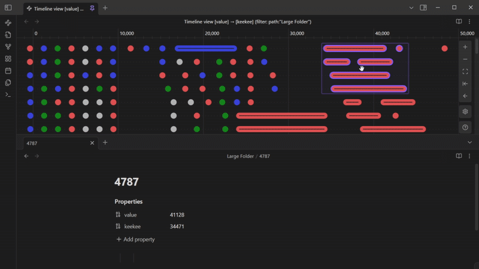

<h1 align="center">Obsidian Timeline View</h1>

Display your obsidian notes in a timeline, based on a given property.

Transform the way you explore your notes with the Obsidian Timeline View Plugin! This powerful plugin introduces a dynamic new view in Obsidian, allowing you to visually order your notes based on custom properties. Whether you're tracking dates, progress, or any numerical data, you can bring clarity to your vault with an interactive graphical "timeline" or "number line."

## 🌟 Key Features

-   [**Custom Ordering:**](#ordering-by-any-numeric-property) Choose a property in your notes and instantly see them ordered in a visual timeline or number line.
-   [**Quick Note Creation:**](#-quick-note-creation) Double-click anywhere on the timeline or number line to create a new note with the property value set based on where you clicked.
-   [**Drag & Drop Reordering:**](#-drag--drop-reordering) Easily move notes around, with multi-select support, to update their property values on the fly.
-   [**Filtering:**](#-filter) Refine your view with filters using Obsidian’s search syntax.
-   [**Grouping with Color:**](#-group-notes-with-colors) Group notes by Obsidian search query, similar to Obsidian's graph view, for a more colorful visualization.

# Screenshots

#### Light Theme

#### Dark Theme

The view should work with any theme you apply.

## Features

### Ordering by _Any_ (numeric) Property

Each Timeline View orders your notes based on a property of your choice, which defaults to the creation time. You can open multiple views, each with its own selected property.

The plugin detects all properties within your vault and lists any numeric (date, datetime, or number) properties as available options. Once a property is selected, the notes automatically rearrange, and the timeline adapts to the appropriate measurement.

When a property is selected, the notes will automatically be re-arranged, and the appropriate type of measurement will appear at the top of the timeline.

### ✨ Quick Note Creation

Double-click anywhere on the timeline to instantly create a new note. The property value for this note will be automatically set based on where you clicked on the timeline.

### 📌 Drag & Drop Reordering

Easily update the property value of a note by dragging and dropping it on the timeline.

-   Move a single note:

    

-   Or move a selection of notes to change their values together.

    

### 🔍 Filter

Want to focus only on relevant notes? Apply a filter to your timeline using a query that (mostly) follows Obsidian's search syntax. For details on syntax limitations, see [Obsidian Search](https://github.com/b-camphart/obsidian-search).

The filtered view renames the tab to match the provided filter, making it easy to differentiate between multiple open timeline tabs.

You can also set a default filter in the plugin settings to apply to every new timeline you open.

### 🎨 Group Notes with Colors

Use the same query syntax as filtering to group notes by color, similar to Obsidian's graph view. This makes it easy to visually distinguish different groups of notes on your timeline.

### 🔗 Link to Tab

Open the timeline as a "linked view" from within an existing tab, or link it to another tab after opening. Once linked, navigating to a new note automatically focuses and scrolls the timeline to that note.

Additionally, clicking on a note in the linked timeline will open it in the linked tab.

# Roadmap

-   [x] Filter based on obsidian query
-   [x] Color groups based on obsidian query
-   [x] [Create new note with property based on filter and position in timeline](https://github.com/b-camphart/plot-point-timeline/issues/4)
-   [ ] [Manual Vertical Positioning of Notes](https://github.com/b-camphart/plot-point-timeline/issues/1)
-   [ ] [Vertical Layout](https://github.com/b-camphart/plot-point-timeline/issues/2)
-   [ ] [Embeds?](https://github.com/b-camphart/plot-point-timeline/issues/6)
-   [ ] [Mobile support](https://github.com/b-camphart/plot-point-timeline/issues/7)
-   [ ] Duration/length and/or end property
